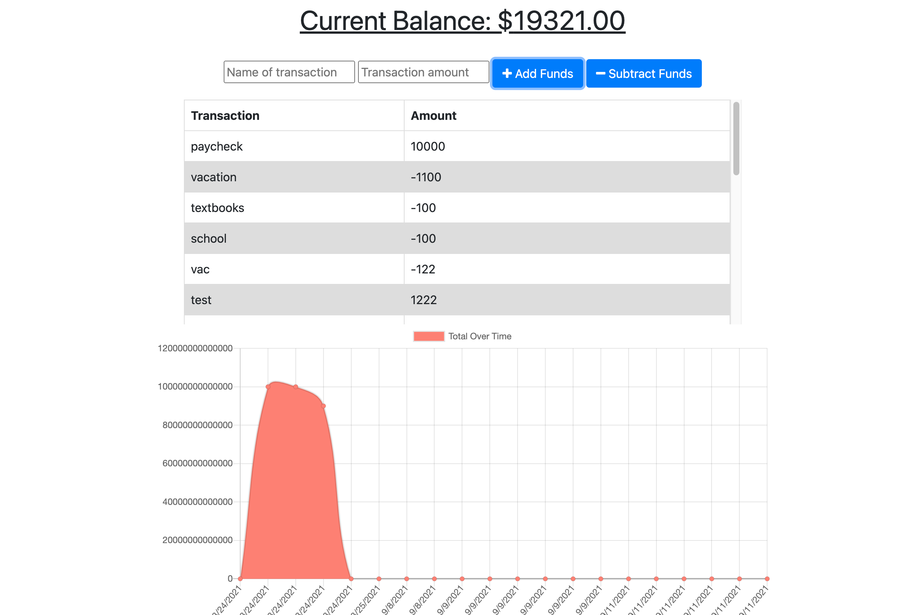

# Title:

Progressive-Budget

## Table of Contents:

- [Project Description](#description)
- [Installation](#installation)
- [Usage](#usage)
- [License](#license)
- [Test](#test)
- [Questions](#questions)

## Description:

Using progressive budget app, users will be able to add expenses and deposits to their budget with or without a connection. When entering transactions offline, they should populate the total when brought back online.

## Installation:

Clone the repository to your local development environment. To start the server, run npm start.

## Usage:

## Questions

Contact me for any questions!!

- Contact Email: kahurasamuel@gmail.com
- GitHub Profile: [snk-99](https://github.com/snk-99snk-99)
